# PMAN - Multi-OS Password Manager

A secure, multi-OS compatible password manager designed for teams with advanced automation support and enterprise-grade security features.

[](https://golang.org)
[](https://creativecommons.org/licenses/by-nd/4.0/)
[]()

## 🚀 Features

### Core Functionality
- **🔐 Secure Password Storage** - AES encryption with environment-specific keys
- **👥 Multi-User Support** - Team-based access with role-based permissions  
- **🌐 Cross-Platform** - Native binaries for Linux, macOS, Windows, FreeBSD
- **🔗 API-First Design** - RESTful backend with JWT authentication
- **🎯 Automation Friendly** - Pipe support and scriptable commands

### CLI Commands
- **Authentication**: `login`, `logout`, `passwd`
- **Password Management**: `add`, `get`, `edit`, `rm`, `ls`, `info`
- **Group Management**: `setgroup` with priority resolution
- **Admin Functions**: `useradd`, `userdel`, `userlist`, `userupdate`, `userenable`, `userdisable`

### Advanced Features
- **🏷️ Beautiful Tree Display** - Groups 🏷️, folders 📁, and passwords 🔑
- **🔒 Token Blacklisting** - Immediate revocation on user disable
- **🧹 Automatic Cleanup** - Empty folders disappear automatically
- **⚡ High Performance** - SQLite backend with optimized queries
- **🛡️ Enterprise Security** - Token tracking, audit trails, secure hashing

## 📦 Quick Start

### Installation

Download pre-built binaries from [releases](https://github.com/dcgsteve/pman/releases) or build from source:

```bash
git clone https://github.com/dcgsteve/pman.git
cd pman
./build-binaries.sh
```

### Server Setup

#### Docker Deployment (Recommended)

```bash
# Build Docker image locally
./build-docker-server.sh

# Or build and push to Docker Hub
./build-docker-server.sh /p

# Run with docker-compose
export PMAN_ENCRYPTION_KEY="your-32-character-encryption-key"
export PMAN_DOMAIN_NAME="your-server.example.com"
export PMAN_UID=$(id -u)  # Optional: match host user for volume permissions
export PMAN_GID=$(id -g)  # Optional: match host group for volume permissions
docker-compose up -d
```

Note: Pre-built server images are available on Docker Hub: **[dcgsteve/pman-server](https://hub.docker.com/r/dcgsteve/pman-server)**

### Client Usage

```bash
# First login (interactive - prompts for server, email, password)
pman login

# First login (non-interactive with parameters)
pman login -s https://your-server.com -u admin@pman.system -p DefaultPassword

# Login with custom token expiry
pman login -expire 10  # Token valid for 10 days

# Change default password
pman passwd

# Set default group
pman setgroup team1

# Add passwords
pman add project1/database/password
echo "secret123" | pman add project1/api/key

# List passwords (beautiful tree view)
pman ls

# Get password for automation
DB_PASS=$(pman get project1/database/password)
```

## 🏗️ Architecture

```mermaid
flowchart LR
    Client["🖥️ CLI Client<br/>Go Binary"]
    API["🚀 Backend API<br/>Docker/Binary"]
    Config["⚙️ Config<br/>Encrypted JWT"]
    Database["🗄️ Database<br/>SQLite + AES"]

    Client <--> |"🔒 HTTPS + JWT"| API
    Client --> |"🔐 Local Encryption"| Config
    API --> |"🔐 AES-256"| Database

    classDef client fill:#2196F3,stroke:#1976D2,stroke-width:2px,color:#fff
    classDef server fill:#4CAF50,stroke:#388E3C,stroke-width:2px,color:#fff
    classDef storage fill:#FF9800,stroke:#F57C00,stroke-width:2px,color:#fff
    
    class Client client
    class API server
    class Config,Database storage
```



### Security Architecture
- **🔒 End-to-End Security** - Data encrypted in transit (HTTPS) and at rest (AES-256)
- **🎫 JWT Authentication** - Stateless tokens with configurable expiration
- **🔑 Dual Encryption** - Separate client and server encryption keys
- **🚫 Token Blacklisting** - Immediate revocation on user disable
- **👥 RBAC** - Role-based access control with group permissions

### Docker Features
- **🐳 Containerized Backend** - Production-ready Docker deployment
- **🔧 Configurable User Permissions** - Runtime UID/GID adjustment via environment variables
- **📁 Volume Mounting** - Persistent data storage with proper permissions
- **🏥 Health Checks** - Built-in container health monitoring

## 🔧 Development

### Build System

```bash
# Docker build (local only)
./build-docker-server.sh

# Docker build and push to registry
./build-docker-server.sh /p
```

### Build Targets

- `linux/amd64`, `linux/arm64`
- `darwin/amd64`, `darwin/arm64` (macOS)
- `windows/amd64`, `windows/arm64`
- `freebsd/amd64`

## 📚 Documentation

- **[Installation Guide](INSTALL.md)** - Deployment and setup instructions
- **[Feature Specification](CLAUDE.md)** - Complete feature documentation
- **[Build Tasks](tasks.md)** - Development progress tracking

## 🔒 Security

PMAN implements enterprise-grade security:

- **🔐 AES-256 Encryption** - All passwords encrypted at rest
- **🎫 JWT Authentication** - Secure token-based auth with expiration
- **🚫 Token Blacklisting** - Immediate revocation on user disable
- **🔑 Machine-Specific Keys** - Client configs encrypted per machine
- **👥 Role-Based Access** - Admin/user roles with group permissions
- **📊 Audit Trails** - Creation/modification tracking per password

## 🎯 Use Cases

### Development Teams
```bash
# Team lead sets up shared credentials
pman add staging/database/password
pman add prod/api/keys/stripe

# Developers access as needed
export DB_PASS=$(pman get staging/database/password)
```

### DevOps Automation
```bash
# CI/CD pipeline integration
DEPLOY_KEY=$(pman get deploy/ssh/production)
ssh -i <(echo "$DEPLOY_KEY") deploy@server
```

### Enterprise Environment
```bash
# Admin manages users
pman useradd "developer@company.com" "user" "dev-team:rw,staging:ro"
pman userdisable "former-employee@company.com"  # Revokes all tokens immediately
```

## 🤝 Contributing

1. Fork the repository
2. Create feature branch (`git checkout -b feature/amazing-feature`)
3. Commit changes (`git commit -m 'Add amazing feature'`)
4. Push to branch (`git push origin feature/amazing-feature`)
5. Open Pull Request

## 📄 License

This project is licensed under the Creative Commons Attribution-NoDerivatives 4.0 International License - see the [LICENSE](LICENSE) file for details.

**What this means:**
- ✅ **Free to use** - Individual and enterprise use without cost
- ✅ **Free to distribute** - Share the original software freely
- ✅ **Attribution required** - Credit the original creator
- ❌ **No modifications** - Use as-is, no code changes allowed, please branch and then raise pull request with changes


## 🙏 Acknowledgments

- Built with Go for performance and cross-platform compatibility
- SQLite for reliable local storage
- JWT for secure authentication
- Claude Code for faster(😂) coding experience
- Inspired by the need for *simple* automation-friendly password management

---

**PMAN** - Making password management simple, secure, and scriptable for teams. 🔐
