# PMAN API Endpoints

## Overview

This document provides a visual representation of all API endpoints in the PMAN server using a Mermaid diagram.

## Endpoint Diagram

```mermaid
graph TD
    Root["/"] --> Health["/health<br/>GET<br/>🔓 Public"]
    Root --> Auth["/auth"]
    Root --> Passwords["/passwords<br/>🔒 Auth Required"]
    Root --> Admin["/admin<br/>🔒 Admin Only"]
    
    Auth --> Login["/auth/login<br/>POST<br/>🔓 Public"]
    Auth --> ChangePass["/auth/passwd<br/>POST<br/>🔒 Auth Required"]
    
    Passwords --> CreatePwd["POST /passwords<br/>Create new password"]
    Passwords --> ListPwd["GET /passwords/{group}<br/>List passwords in group"]
    Passwords --> GetPwd["GET /passwords/{group}/{path:.*}<br/>Get password value"]
    Passwords --> UpdatePwd["PUT /passwords/{group}/{path:.*}<br/>Update password"]
    Passwords --> DeletePwd["DELETE /passwords/{group}/{path:.*}<br/>Delete password"]
    Passwords --> InfoPwd["GET /passwords/{group}/{path:.*}/info<br/>Get password metadata"]
    
    Admin --> Users["/admin/users"]
    Users --> CreateUser["POST /admin/users<br/>Create new user"]
    Users --> ListUsers["GET /admin/users<br/>List all users"]
    Users --> UpdateUser["PUT /admin/users/{email}<br/>Update user details"]
    Users --> DeleteUser["DELETE /admin/users/{email}<br/>Delete user"]
    Users --> EnableUser["POST /admin/users/{email}/enable<br/>Enable user account"]
    Users --> DisableUser["POST /admin/users/{email}/disable<br/>Disable user account"]
    Users --> AdminChangePwd["POST /admin/users/{email}/passwd<br/>Change user password (admin)"]
    
    style Health fill:#e8f5e9,stroke:#4caf50,stroke-width:2px,color:#1b5e20
    style Login fill:#e8f5e9,stroke:#4caf50,stroke-width:2px,color:#1b5e20
    style Auth fill:#fff3e0,stroke:#ff9800,stroke-width:2px,color:#e65100
    style Passwords fill:#fff3e0,stroke:#ff9800,stroke-width:2px,color:#e65100
    style Admin fill:#fce4ec,stroke:#e91e63,stroke-width:2px,color:#880e4f
    style Users fill:#fce4ec,stroke:#e91e63,stroke-width:2px,color:#880e4f
    style CreatePwd fill:#f5f5f5,stroke:#757575,stroke-width:1px,color:#212121
    style ListPwd fill:#f5f5f5,stroke:#757575,stroke-width:1px,color:#212121
    style GetPwd fill:#f5f5f5,stroke:#757575,stroke-width:1px,color:#212121
    style UpdatePwd fill:#f5f5f5,stroke:#757575,stroke-width:1px,color:#212121
    style DeletePwd fill:#f5f5f5,stroke:#757575,stroke-width:1px,color:#212121
    style InfoPwd fill:#f5f5f5,stroke:#757575,stroke-width:1px,color:#212121
    style CreateUser fill:#f5f5f5,stroke:#757575,stroke-width:1px,color:#212121
    style ListUsers fill:#f5f5f5,stroke:#757575,stroke-width:1px,color:#212121
    style UpdateUser fill:#f5f5f5,stroke:#757575,stroke-width:1px,color:#212121
    style DeleteUser fill:#f5f5f5,stroke:#757575,stroke-width:1px,color:#212121
    style EnableUser fill:#f5f5f5,stroke:#757575,stroke-width:1px,color:#212121
    style DisableUser fill:#f5f5f5,stroke:#757575,stroke-width:1px,color:#212121
    style AdminChangePwd fill:#f5f5f5,stroke:#757575,stroke-width:1px,color:#212121
    style ChangePass fill:#f5f5f5,stroke:#757575,stroke-width:1px,color:#212121
```

## Endpoint Categories

### 🔓 Public Endpoints (No Authentication Required)
- `GET /health` - Health check endpoint
- `POST /auth/login` - User login

### 🔒 Protected Endpoints (Authentication Required)

#### Password Management
- `POST /passwords` - Create a new password entry
- `GET /passwords/{group}` - List all passwords in a group
- `GET /passwords/{group}/{path:.*}` - Retrieve a specific password
- `PUT /passwords/{group}/{path:.*}` - Update an existing password
- `DELETE /passwords/{group}/{path:.*}` - Delete a password
- `GET /passwords/{group}/{path:.*}/info` - Get password metadata (without the actual password)

#### User Authentication
- `POST /auth/passwd` - Change own password

### 🔒 Admin-Only Endpoints

All admin endpoints require both authentication and admin role:

#### User Management
- `POST /admin/users` - Create a new user
- `GET /admin/users` - List all users
- `PUT /admin/users/{email}` - Update user details
- `DELETE /admin/users/{email}` - Delete a user
- `POST /admin/users/{email}/enable` - Enable a user account
- `POST /admin/users/{email}/disable` - Disable a user account
- `POST /admin/users/{email}/passwd` - Change another user's password

## Authentication Flow

1. **Login**: Client sends credentials to `/auth/login`
2. **Token**: Server returns JWT token if credentials are valid
3. **Requests**: Client includes token in `Authorization: Bearer <token>` header
4. **Validation**: Server validates token on each protected endpoint

## Path Parameters

- `{group}` - The group name for password organization
- `{path:.*}` - The hierarchical path to the password (supports slashes)
- `{email}` - User email address for user management endpoints

## Notes

- The logout functionality is handled client-side by removing the stored token
- All endpoints except `/health` and `/auth/login` require JWT authentication
- Admin endpoints require both authentication and admin role
- The `{path:.*}` pattern allows for hierarchical password paths like `servers/production/db-password`